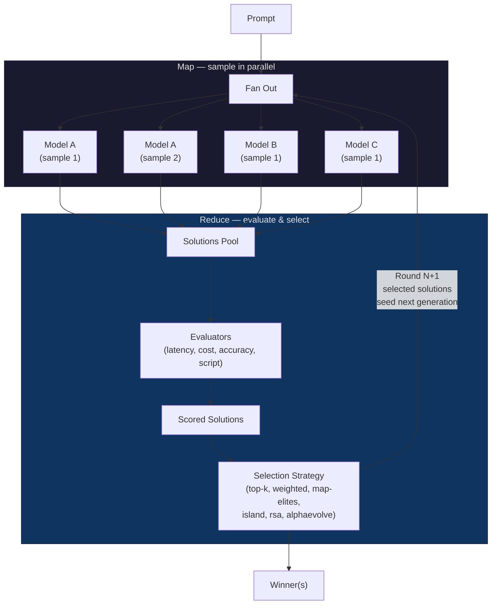

# fanout

**A map-reduce primitive for LLM agents.**

Fanout takes a prompt, fans it out across multiple LLM models in parallel (the *map* phase), evaluates and scores every response, then selects the best outputs to seed the next round (the *reduce* phase). Repeat for N rounds and you get evolutionary refinement — the same prompt is re-sampled, but each generation is informed by what worked before.

This is useful any time you want to treat LLM outputs as a population rather than a single shot: code generation, prompt engineering, config tuning, creative writing, or any task where quality varies across models and samples.

## How it works



**Each round is one map-reduce cycle:**

1. **Fan out (map):** Send the prompt to one or more models, drawing N samples. Models can be specified explicitly (`-m`) or pulled from a weighted *model set* (`-M`).
2. **Evaluate:** Run every solution through a stack of evaluators — built-in (latency, cost, accuracy) or a custom eval script that tests the output for real.
3. **Select (reduce):** A selection strategy picks the top solutions. These become the parents for the next round.
4. **Repeat:** The loop runs for as many rounds as you want, converging on better outputs each generation.

## Install

### Local development

```bash
git clone https://github.com/dimenwarper/fanout.git
cd fanout
uv sync
```

This installs fanout into a local virtualenv. Use `uv run fanout` to run it.

### System-wide install (CLI + Claude Code skills)

The install script does two things: installs the `fanout` CLI globally via `uv tool`, and registers `/fanout` and `/fanout-setup` as slash commands in Claude Code.

```bash
git clone https://github.com/dimenwarper/fanout.git
cd fanout
./install.sh
```

After install:
- **`fanout`** is available as a global command from any directory
- **`/fanout`** is available as a slash command in any Claude Code session — it walks you through running a fanout loop
- **`/fanout-setup`** configures your `.env` with API keys

To uninstall:

```bash
uv tool uninstall fanout
rm ~/.claude/commands/fanout.md ~/.claude/commands/fanout-setup.md
```

### API key

Requires an `OPENROUTER_API_KEY` environment variable (or a `.env` file in your project root). Get one at [openrouter.ai/keys](https://openrouter.ai/keys).

## Quick start

```bash
# Full evolutionary run: 3 rounds, 2 models, top-k selection
uv run fanout run "Write a haiku about recursion" \
  -m openai/gpt-4o-mini -m anthropic/claude-haiku-4 \
  -e latency -e cost \
  -s top-k -r 3 -n 5

# Using a model set (weighted random draws)
uv run fanout run "Explain monads in one paragraph" \
  -M coding -n 5 -e accuracy --reference "A monad is..."

# Step by step
uv run fanout sample "Write a haiku" -m openai/gpt-4o-mini -n 3
uv run fanout evaluate <RUN_ID> -e latency -e cost
uv run fanout select <RUN_ID> -s top-k --k 2
```

### Script evaluation with materializers

For use cases like code generation, you can provide a custom eval script. Fanout *materializes* each solution (writes it to a file, pipes it via stdin, or applies it as a git diff), then runs your script against it. The script's last stdout line is parsed as a score (0.0-1.0).

```bash
# Write a test script
cat > /tmp/test_sort.sh << 'EOF'
#!/bin/bash
python3 -c "
import sys
exec(open(sys.argv[1]).read())
result = sort_records([{'date':'2025-01-02'},{'date':'2025-01-01'}])
print(1.0 if result == [{'date':'2025-01-01'},{'date':'2025-01-02'}] else 0.0)
" "$1"
EOF
chmod +x /tmp/test_sort.sh

# Run with script evaluation
uv run fanout run \
  "Write a Python function sort_records(records: list[dict]) -> list[dict] that sorts by the date field." \
  -M coding -n 5 --eval-script /tmp/test_sort.sh --materializer file
```

## Concepts

### LLM ensembles and model sets

Rather than betting on a single model, fanout treats models as an **ensemble** — each round samples from multiple models and lets the evaluator decide which outputs are best. This exploits the fact that different models have different strengths: one may produce cleaner code structure while another nails edge cases.

There are two ways to specify which models to sample:

- **Explicit models** (`-m`): List specific models. The `-n` total samples are distributed round-robin across them. E.g. `-m openai/gpt-4o-mini -m anthropic/claude-haiku-4 -n 6` gives 3 samples from each.

- **Model sets** (`-M`): Named collections of models with weights for weighted-random sampling. Higher-weight models get drawn more often. Fanout ships with several built-in sets (`coding`, `math-proving`, `diverse`, `large`, `small`), and you can define your own in a `model_sets.toml` file. Use `fanout list-model-sets` to see what's available.

Model sets are especially useful for evolutionary runs — different rounds may draw different model mixes, letting the selection strategy discover which models work best for a given task.

### Evaluators

Evaluators score each solution on a 0.0-1.0 scale. Multiple evaluators can be stacked (`-e latency -e cost -e script`) and their scores are aggregated.

| Name | Description |
|------|-------------|
| `latency` | Scores inversely proportional to response time — faster is better |
| `cost` | Scores inversely proportional to token usage — cheaper is better |
| `accuracy` | Scores by similarity to a `--reference` answer (exact or fuzzy match) |
| `script` | Runs a user-provided `--eval-script` against materialized output — the script's last stdout line is the score |

The `script` evaluator is the most powerful: it lets you run real tests, benchmarks, or any custom logic against the generated output. Evaluations can be parallelized with `-p` / `--eval-concurrency` to speed up script evals on multi-core machines.

### Materializers

Materializers control how a solution's output is presented to an eval script. The eval script receives the materialized output and returns a score.

| Name | Description |
|------|-------------|
| `file` | Writes output to a temp file (e.g. `output.py`), passes the file path as an argument to the eval script. Use `--file-ext` to control the extension. |
| `stdin` | Pipes the raw output to the eval script via stdin |
| `worktree` | Creates a git worktree from HEAD, applies the output as a unified diff, and passes the worktree path to the eval script. Useful when solutions are patches rather than standalone files. |

### Selection strategies

Selection strategies determine how solutions survive between rounds. The choice of strategy significantly affects the evolutionary dynamics.

| Name | Description |
|------|-------------|
| `top-k` | Select the K highest-scoring solutions. Simple and effective — pure elitism. |
| `weighted` | Sample with probability proportional to score. Maintains more diversity than top-k by giving lower-scoring solutions a chance to survive. |
| `rsa` | **[Recursive Self-Aggregation](https://arxiv.org/html/2509.26626v1).** After round 1, each new solution is generated from a prompt that includes K randomly subsampled parent solutions. The model synthesizes an improvement from those parents rather than starting from scratch. `--k-agg` controls how many parents each prompt includes. |
| `alphaevolve` | Inspired by [AlphaEvolve](https://arxiv.org/abs/2506.13131). Combines score-aware tournament selection with diversity preservation, score-annotated aggregation prompts, and score-biased parent subsampling. Designed for tasks where both quality and diversity matter. |
| `map-elites` | Selects the best solution per behavioral dimension cell (e.g., model, output length bucket). Maintains a diverse archive across multiple niches rather than converging on a single solution type. |
| `island` | Evolves separate subpopulations per model with periodic migration of top solutions between islands. Useful when different models have fundamentally different solution styles and you want to preserve that diversity while still sharing good ideas. |

## Examples

### 1. Discover available plugins

```bash
# List materializers (file, stdin, worktree)
uv run fanout list-materializers

# List evaluators (latency, cost, accuracy, script)
uv run fanout list-evaluators

# List selection strategies
uv run fanout list-strategies

# List model sets (builtins + user-defined)
uv run fanout list-model-sets
```

### 2. Code generation with script evaluation

Write a sorting function across multiple models and score each solution with a real test:

```bash
# Create an eval script that tests the generated function
cat > /tmp/test_sort.sh << 'EVAL'
#!/bin/bash
python3 -c "
import sys; sys.path.insert(0, '.')
exec(open(sys.argv[1]).read())
print(1.0 if sort_records([{'date':'2025-01-02'},{'date':'2025-01-01'}]) == [{'date':'2025-01-01'},{'date':'2025-01-02'}] else 0.0)
" "$1"
EVAL
chmod +x /tmp/test_sort.sh

# Fan out across a coding model set, evaluate with the test script
uv run fanout run \
  "Write a Python function sort_records(records: list[dict]) -> list[dict] that sorts by the date field." \
  -M coding -n 5 --eval-script /tmp/test_sort.sh --materializer file --file-ext .py
```

Each solution is written to `.fanout/workspace/<run_id>/<solution_id>/output.py`, then `/tmp/test_sort.sh` is called with that path. The last line of stdout (`1.0` or `0.0`) becomes the score.

### 3. Multi-round evolutionary refinement

Run multiple rounds so the best outputs from each generation seed the next:

```bash
uv run fanout run "Write a concise Python function that finds all prime factors of an integer n." \
  -m openai/gpt-4o-mini -m anthropic/claude-haiku-4 -m google/gemini-flash-1.5 \
  -e latency -e cost \
  -s top-k --k 2 \
  -r 3 -n 6
```

This runs 3 rounds. Each round draws 6 total samples distributed across the 3 models (2 each), scores them on latency and cost, selects the top 2, and uses those as parents for the next round.

### 4. Recursive Self-Aggregation (RSA)

RSA is a strategy where, after round 1, each new solution is generated from a prompt that includes K randomly subsampled parent solutions. The model is asked to synthesize an improvement from those parents rather than starting from scratch.

```bash
uv run fanout run "Write a Python fibonacci function that handles edge cases" \
  -m openai/gpt-4o-mini -n 5 \
  -s rsa --k-agg 2 -r 3 \
  -e latency -e cost
```

- **Round 1:** Independent sampling (same as any other strategy).
- **Round 2+:** Each sample receives the original task plus K parent outputs, with instructions to combine their best ideas. Different samples see different random subsets of parents.

The `--k-agg` flag controls how many parent solutions each new prompt includes (default 3).

### 5. AlphaEvolve

The `alphaevolve` strategy is inspired by [AlphaEvolve](https://arxiv.org/html/2509.26626v1). It combines several techniques: score-aware tournament selection for picking parents, score-annotated prompts so the model knows which parents scored well, and diversity-preserving selection to avoid premature convergence.

```bash
uv run fanout run "Optimize this circle packing algorithm..." \
  -M coding -n 8 \
  -s alphaevolve --k-agg 3 -r 5 \
  --eval-script ./eval.sh -p 4
```

### 6. Parallel evaluation

Use `-p` to run evaluations concurrently — useful for CPU-bound script evals on multi-core machines:

```bash
# Run up to 8 evals in parallel
uv run fanout run "..." \
  -M coding -n 10 --eval-script ./eval.sh -p 8
```

### 7. Verbose output

Use `-v` to see syntax-highlighted solution previews, per-solution scores, and eval stderr/stdout:

```bash
uv run fanout run "..." -M coding -n 5 -r 3 --eval-script ./eval.sh -v
```

## Commands

| Command | Description |
|---------|-------------|
| `fanout run` | Full loop: sample, evaluate, select for N rounds |
| `fanout sample` | Fan out a prompt to models |
| `fanout evaluate` | Score solutions with evaluators |
| `fanout select` | Pick best solutions using a strategy |
| `fanout store` | List runs or inspect a specific run |
| `fanout list-evaluators` | Show available evaluators |
| `fanout list-materializers` | Show available materializers |
| `fanout list-strategies` | Show available strategies |
| `fanout list-model-sets` | Show available model sets |

## Architecture

```
src/fanout/
├── cli.py                 # Typer CLI entry point
├── sample.py              # Sampling orchestration
├── evaluate.py            # Evaluation orchestration (supports parallel via -p)
├── select.py              # Selection orchestration
├── store.py               # SQLite persistence
├── model_sets.py           # Weighted model set definitions
├── db/
│   └── models.py          # Pydantic data models (Run, Solution, Evaluation)
├── providers/
│   └── openrouter.py      # OpenRouter API client (with retry + backoff)
├── evaluators/
│   ├── base.py            # ABC + plugin registry
│   ├── latency.py         # Built-in: latency scoring
│   ├── accuracy.py        # Built-in: reference similarity
│   ├── cost.py            # Built-in: cost scoring
│   └── script.py          # User-provided eval script
├── materializers/
│   ├── base.py            # ABC + plugin registry
│   ├── file.py            # Write output to file
│   ├── stdin.py           # Pipe output via stdin
│   └── worktree.py        # Git worktree + diff apply
└── strategies/
    ├── base.py            # ABC + plugin registry
    ├── top_k.py           # Top-K selection
    ├── weighted.py        # Weighted random selection
    ├── rsa.py             # Recursive Self-Aggregation
    ├── alphaevolve.py     # AlphaEvolve (score-aware + diversity-preserving)
    ├── map_elites.py      # MAP-Elites diversity selection
    └── island.py          # Island model with migration
```

Data is stored in `.fanout/fanout.db` (SQLite, WAL mode) in the project directory.
