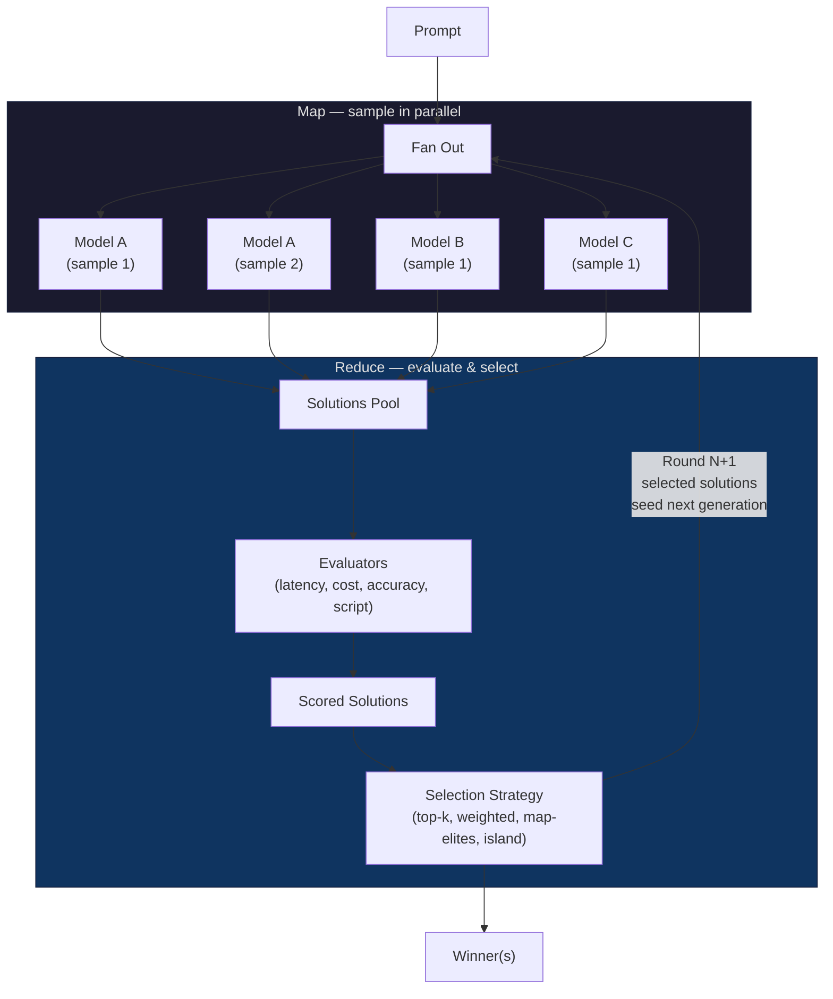

# fanout

**A map-reduce primitive for LLM agents.**

Fanout takes a prompt, fans it out across multiple LLM models in parallel (the *map* phase), evaluates and scores every response, then selects the best outputs to seed the next round (the *reduce* phase). Repeat for N rounds and you get evolutionary refinement — the same prompt is re-sampled, but each generation is informed by what worked before.

This is useful any time you want to treat LLM outputs as a population rather than a single shot: code generation, prompt engineering, config tuning, creative writing, or any task where quality varies across models and samples.

## How it works



**Each round is one map-reduce cycle:**

1. **Fan out (map):** Send the prompt to one or more models, drawing N samples. Models can be specified explicitly or pulled from a weighted *model set*.
2. **Evaluate:** Run every solution through a stack of evaluators — built-in (latency, cost, accuracy) or a custom eval script that tests the output for real.
3. **Select (reduce):** A selection strategy picks the top solutions. These become the parents for the next round.
4. **Repeat:** The loop runs for as many rounds as you want, converging on better outputs each generation.

## Install

```bash
uv sync
```

Requires an `OPENROUTER_API_KEY` environment variable (or a `.env` file in your project root).

## Quick start

```bash
# Full evolutionary run: 3 rounds, 2 models, top-k selection
uv run fanout run "Write a haiku about recursion" \
  -m openai/gpt-4o-mini -m anthropic/claude-3-haiku \
  -e latency -e cost \
  -s top-k -r 3 -n 2

# Using a model set (weighted random draws)
uv run fanout run "Explain monads in one paragraph" \
  -M coding -N 5 -e accuracy --reference "A monad is..."

# Step by step
uv run fanout sample "Write a haiku" -m openai/gpt-4o-mini -n 3
uv run fanout evaluate <RUN_ID> -e latency -e cost
uv run fanout select <RUN_ID> -s top-k --k 2
```

### Script evaluation with materializers

For use cases like code generation, you can provide a custom eval script. Fanout *materializes* each solution (writes it to a file, pipes it via stdin, or applies it as a git diff), then runs your script against it. The script's last stdout line is parsed as a score (0.0–1.0).

```bash
# Write a test script
cat > /tmp/test_sort.sh << 'EOF'
#!/bin/bash
python3 -c "
import sys
exec(open(sys.argv[1]).read())
result = sort_records([{'date':'2025-01-02'},{'date':'2025-01-01'}])
print(1.0 if result == [{'date':'2025-01-01'},{'date':'2025-01-02'}] else 0.0)
" "$1"
EOF
chmod +x /tmp/test_sort.sh

# Run with script evaluation
uv run fanout run \
  "Write a Python function sort_records(records: list[dict]) -> list[dict] that sorts by the date field." \
  -M coding -N 3 --eval-script /tmp/test_sort.sh --materializer file
```

## Commands

| Command | Description |
|---------|-------------|
| `fanout run` | Full loop: sample → evaluate → select × N rounds |
| `fanout sample` | Fan out a prompt to models |
| `fanout evaluate` | Score solutions with evaluators |
| `fanout select` | Pick best solutions using a strategy |
| `fanout store` | List runs or inspect a specific run |
| `fanout list-evaluators` | Show available evaluators |
| `fanout list-materializers` | Show available materializers |
| `fanout list-strategies` | Show available strategies |
| `fanout list-model-sets` | Show available model sets |

## Evaluators

| Name | Description |
|------|-------------|
| `latency` | Scores inversely proportional to response time |
| `accuracy` | Scores by similarity to a reference answer |
| `cost` | Scores inversely proportional to token cost |
| `script` | Runs a user-provided eval script against materialized output |

## Materializers

Materializers control how a solution's output is presented to an eval script.

| Name | Description |
|------|-------------|
| `file` | Writes output to a file (default `output.py`), passes path as arg |
| `stdin` | Pipes output to the eval script via stdin |
| `worktree` | Creates a git worktree from HEAD, applies output as a unified diff |

## Selection Strategies

| Name | Description |
|------|-------------|
| `top-k` | Select the K highest-scoring solutions |
| `weighted` | Sample with probability proportional to score |
| `map-elites` | Best solution per behavioral dimension cell |
| `island` | Subpopulation evolution with migration |

## Architecture

```
src/fanout/
├── cli.py                 # Typer CLI entry point
├── sample.py              # Sampling orchestration
├── evaluate.py            # Evaluation orchestration
├── select.py              # Selection orchestration
├── store.py               # SQLite persistence
├── model_sets.py           # Weighted model set definitions
├── db/
│   └── models.py          # Pydantic data models (Run, Solution, Evaluation)
├── providers/
│   └── openrouter.py      # OpenRouter API client
├── evaluators/
│   ├── base.py            # ABC + plugin registry
│   ├── latency.py         # Built-in: latency scoring
│   ├── accuracy.py        # Built-in: reference similarity
│   ├── cost.py            # Built-in: cost scoring
│   └── script.py          # User-provided eval script
├── materializers/
│   ├── base.py            # ABC + plugin registry
│   ├── file.py            # Write output to file
│   ├── stdin.py           # Pipe output via stdin
│   └── worktree.py        # Git worktree + diff apply
└── strategies/
    ├── base.py            # ABC + plugin registry
    ├── top_k.py           # Top-K selection
    ├── weighted.py        # Weighted random selection
    ├── map_elites.py      # MAP-Elites diversity selection
    └── island.py          # Island model with migration
```

Data is stored in `.fanout/fanout.db` (SQLite, WAL mode) in the project directory.
