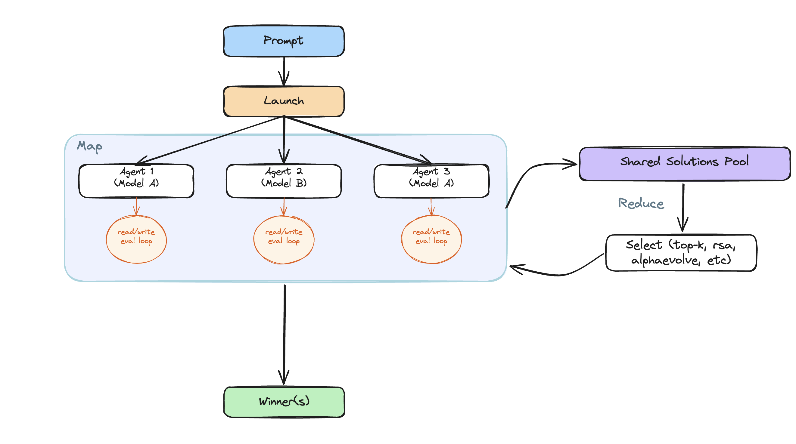
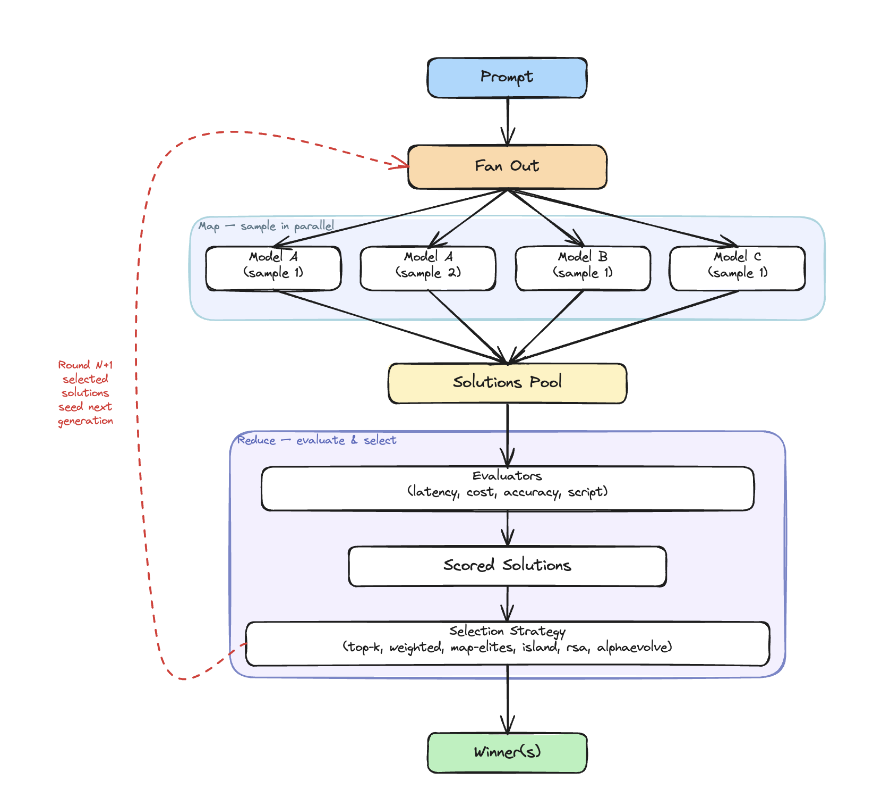

<p align="center">
  
</p>


# What is fanout?

```
python tldr.py
```
<p align="center">
  
</p>


So basically:

**Self-improvement primitives for agents**

Fanout is directly inspired my methods like GEPA and Alphaevolve, but gives more fine-grained control over the sampling, agentic optimizaiton, selection, and aggregation components of each to an orchestrating agent, like e.g. Claude Code (see claude/skill), allowing model sets, different materializer strategies for evaluation, among other things. This is useful any time you want to treat LLM outputs as a population rather than a single shot: code generation, prompt engineering, config tuning, creative writing, or any task where quality varies across models and samples. I'm considering adding backends to this as well, so you get large compute when needed.

In a nutshell, fanout takes a prompt, fans it out across multiple LLM models in parallel either via sampling or through agentic threads (the *map* phase), evaluates and scores every response, storing them in a common channel (possibly an SQLite, Redis, or in memory) then selects the best outputs to seed the next round (the *reduce* phase), this is then iteratively repeated. In a one-shot LLM response (sampling), this means repeating for N rounds, reuslting in evolutionary refinement — the same prompt is re-sampled, but each generation is informed by what worked before. In an agentic LLM thread (launching), agents communicate their solutions to each other via the channel, selecting solutions via selection strategies as they go along.

## How it works

There are two kinds of workflows: **Launch** (recommended) and **Sample**. Both fan out work across multiple models in parallel, but they differ in how solutions are produced and refined.

### Launch workflow (recommended)

The launch workflow spawns concurrent **agents** that autonomously iterate on solutions. Each agent reads the prompt, writes solutions, evaluates them, reads what other agents have produced, and improves — all in a shared solution pool. This is the recommended workflow: agents naturally explore diverse strategies, learn from each other in real time, and consistently outperform the sample workflow on optimization benchmarks.

<p align="center">
  
</p>

Each agent runs for up to `--max-steps` iterations, using tools to read the task, submit solutions, run evaluations, and inspect other agents' work.

```bash
# Launch 3 agents, each with up to 10 steps
uv run fanout launch "Write a fast matrix multiply" \
  -m openai/gpt-4o-mini -n 3 --max-steps 10 --eval-script ./eval.sh -v
```

Use `--mode agent` in benchmark runners to use the launch workflow.

### Sample workflow

The sample workflow is a multi-round evolutionary loop. Each round samples solutions from models, evaluates them, selects the best, and uses those to seed the next generation. This is the classic map-reduce pattern applied to LLM outputs. It's useful when you want fine-grained control over selection strategies, or when agents aren't needed (e.g. simple prompt optimization).

<p align="center">
  
</p>

**Each round is one map-reduce cycle:**

1. **Fan out (map):** Send the prompt to one or more models, drawing N samples. Models can be specified explicitly (`-m`) or pulled from a weighted *model set* (`-M`).
2. **Evaluate:** Run every solution through a stack of evaluators — built-in (latency, cost, accuracy) or a custom eval script that tests the output for real.
3. **Select (reduce):** A selection strategy picks the top solutions. These become the parents for the next round.
4. **Repeat:** The loop runs for as many rounds as you want, converging on better outputs each generation.

## Install

### Prerequisites

Fanout uses **Redis** for persistent storage. Install the Redis server:

```bash
# macOS
brew install redis

# Ubuntu / Debian
sudo apt install redis-server
```

When you run fanout, it will automatically connect to Redis on `localhost:6379`, starting the server if it finds `redis-server` on your PATH. If Redis is unavailable, it falls back to an ephemeral in-memory store (data is lost when the process exits).

### Local development

```bash
git clone https://github.com/dimenwarper/fanout.git
cd fanout
uv sync
```

This installs fanout into a local virtualenv. Use `uv run fanout` to run it.

### System-wide install (CLI + Claude Code skills)

The install script does two things: installs the `fanout` CLI globally via `uv tool`, and registers `/fanout` and `/fanout-setup` as slash commands in Claude Code.

```bash
git clone https://github.com/dimenwarper/fanout.git
cd fanout
./install.sh
```

After install:
- **`fanout`** is available as a global command from any directory
- **`/fanout`** is available as a slash command in any Claude Code session — it walks you through running a fanout loop
- **`/fanout-setup`** configures your `.env` with API keys

To uninstall:

```bash
uv tool uninstall fanout
rm ~/.claude/commands/fanout.md ~/.claude/commands/fanout-setup.md
```

### API key

Requires an `OPENROUTER_API_KEY` environment variable (or a `.env` file in your project root). Get one at [openrouter.ai/keys](https://openrouter.ai/keys).

## Quick start

```bash
# Full evolutionary run: 3 rounds, 2 models, top-k selection
uv run fanout run "Write a haiku about recursion" \
  -m openai/gpt-4o-mini -m anthropic/claude-haiku-4 \
  -e latency -e cost \
  -s top-k -r 3 -n 5

# Using a model set (weighted random draws)
uv run fanout run "Explain monads in one paragraph" \
  -M coding -n 5 -e accuracy --reference "A monad is..."

# Step by step
uv run fanout sample "Write a haiku" -m openai/gpt-4o-mini -n 3
uv run fanout evaluate <RUN_ID> -e latency -e cost
uv run fanout select <RUN_ID> -s top-k --k 2
```

### Script evaluation with materializers

For use cases like code generation, you can provide a custom eval script. Fanout *materializes* each solution (writes it to a file, pipes it via stdin, or applies it as a git diff), then runs your script against it. The script's last stdout line is parsed as a score (0.0-1.0).

```bash
# Write a test script
cat > /tmp/test_sort.sh << 'EOF'
#!/bin/bash
python3 -c "
import sys
exec(open(sys.argv[1]).read())
result = sort_records([{'date':'2025-01-02'},{'date':'2025-01-01'}])
print(1.0 if result == [{'date':'2025-01-01'},{'date':'2025-01-02'}] else 0.0)
" "$1"
EOF
chmod +x /tmp/test_sort.sh

# Run with script evaluation
uv run fanout run \
  "Write a Python function sort_records(records: list[dict]) -> list[dict] that sorts by the date field." \
  -M coding -n 5 --eval-script /tmp/test_sort.sh --materializer file
```

## Concepts

### LLM ensembles and model sets

Rather than betting on a single model, fanout treats models as an **ensemble** — each round samples from multiple models and lets the evaluator decide which outputs are best. This exploits the fact that different models have different strengths: one may produce cleaner code structure while another nails edge cases.

There are two ways to specify which models to sample:

- **Explicit models** (`-m`): List specific models. The `-n` total samples are distributed round-robin across them. E.g. `-m openai/gpt-4o-mini -m anthropic/claude-haiku-4 -n 6` gives 3 samples from each.

- **Model sets** (`-M`): Named collections of models with weights for weighted-random sampling. Higher-weight models get drawn more often. Fanout ships with several built-in sets (`coding`, `math-proving`, `diverse`, `large`, `small`), and you can define your own in a `model_sets.toml` file. Use `fanout list-model-sets` to see what's available.

Model sets are especially useful for evolutionary runs — different rounds may draw different model mixes, letting the selection strategy discover which models work best for a given task.

### Evaluators

Evaluators score each solution on a 0.0-1.0 scale. Multiple evaluators can be stacked (`-e latency -e cost -e script`) and their scores are aggregated.

| Name | Description |
|------|-------------|
| `latency` | Scores inversely proportional to response time — faster is better |
| `cost` | Scores inversely proportional to token usage — cheaper is better |
| `accuracy` | Scores by similarity to a `--reference` answer (exact or fuzzy match) |
| `script` | Runs a user-provided `--eval-script` against materialized output — the script's last stdout line is the score |

The `script` evaluator is the most powerful: it lets you run real tests, benchmarks, or any custom logic against the generated output. Evaluations can be parallelized with `-p` / `--eval-concurrency` to speed up script evals on multi-core machines.

### Materializers

Materializers control how a solution's output is presented to an eval script. The eval script receives the materialized output and returns a score.

| Name | Description |
|------|-------------|
| `file` | Writes output to a temp file (e.g. `output.py`), passes the file path as an argument to the eval script. Use `--file-ext` to control the extension. |
| `stdin` | Pipes the raw output to the eval script via stdin |
| `worktree` | Creates a git worktree from HEAD, applies the output as a unified diff, and passes the worktree path to the eval script. Useful when solutions are patches rather than standalone files. |

### Selection strategies

Selection strategies determine how solutions survive between rounds. The choice of strategy significantly affects the evolutionary dynamics.

| Name | Description |
|------|-------------|
| `top-k` | Select the K highest-scoring solutions. Simple and effective — pure elitism. |
| `weighted` | Sample with probability proportional to score. Maintains more diversity than top-k by giving lower-scoring solutions a chance to survive. |
| `rsa` | **[Recursive Self-Aggregation](https://arxiv.org/html/2509.26626v1).** After round 1, each new solution is generated from a prompt that includes K randomly subsampled parent solutions. The model synthesizes an improvement from those parents rather than starting from scratch. `--k-agg` controls how many parents each prompt includes. |
| `alphaevolve` | Inspired by [AlphaEvolve](https://arxiv.org/abs/2506.13131). Combines score-aware tournament selection with diversity preservation, score-annotated aggregation prompts, and score-biased parent subsampling. Designed for tasks where both quality and diversity matter. |
| `map-elites` | Selects the best solution per behavioral dimension cell (e.g., model, output length bucket). Maintains a diverse archive across multiple niches rather than converging on a single solution type. |
| `island` | Evolves separate subpopulations per model with periodic migration of top solutions between islands. Useful when different models have fundamentally different solution styles and you want to preserve that diversity while still sharing good ideas. |
| `darwinian` | **Sigmoid-scaled selection with novelty bonus**, inspired by [Imbue's Darwinian Evolver](https://github.com/imbue-ai/darwinian_evolver) and the Darwin Gödel Machines paper. Parent weight = `sigmoid(sharpness × (score − midpoint)) × (1 / (1 + novelty_weight × times_used_as_parent))`. The sigmoid midpoint adapts to the current score distribution (default: 75th percentile), preventing winner-take-all dynamics. The novelty bonus penalises solutions that have already been used as parents many times, forcing exploration of the population even when one solution dominates. |
| `pareto` | **Pareto-front selection** across multiple evaluator objectives (inspired by [GEPA](https://github.com/gepa-ai/gepa)). A solution is on the Pareto front if no other solution beats it on *all* evaluators simultaneously — preserving genuine quality trade-offs that a single aggregate score would collapse. Front members are returned first; remaining slots are filled by aggregate score. Falls back to top-k with a single evaluator. |
| `epsilon-greedy` | **Epsilon-greedy selection** (inspired by GEPA). With probability `ε` (`--epsilon`, default 0.1) a random candidate is chosen (exploration); otherwise the best remaining is taken (exploitation). Selection is without replacement so all k results are distinct. A simple, interpretable exploration-vs-exploitation baseline. |

## Examples

### 1. Discover available plugins

```bash
# List materializers (file, stdin, worktree)
uv run fanout list-materializers

# List evaluators (latency, cost, accuracy, script)
uv run fanout list-evaluators

# List selection strategies
uv run fanout list-strategies

# List model sets (builtins + user-defined)
uv run fanout list-model-sets
```

### 2. Code generation with script evaluation

Write a sorting function across multiple models and score each solution with a real test:

```bash
# Create an eval script that tests the generated function
cat > /tmp/test_sort.sh << 'EVAL'
#!/bin/bash
python3 -c "
import sys; sys.path.insert(0, '.')
exec(open(sys.argv[1]).read())
print(1.0 if sort_records([{'date':'2025-01-02'},{'date':'2025-01-01'}]) == [{'date':'2025-01-01'},{'date':'2025-01-02'}] else 0.0)
" "$1"
EVAL
chmod +x /tmp/test_sort.sh

# Fan out across a coding model set, evaluate with the test script
uv run fanout run \
  "Write a Python function sort_records(records: list[dict]) -> list[dict] that sorts by the date field." \
  -M coding -n 5 --eval-script /tmp/test_sort.sh --materializer file --file-ext .py
```

Each solution is written to `.fanout/workspace/<run_id>/<solution_id>/output.py`, then `/tmp/test_sort.sh` is called with that path. The last line of stdout (`1.0` or `0.0`) becomes the score.

### 3. Multi-round evolutionary refinement

Run multiple rounds so the best outputs from each generation seed the next:

```bash
uv run fanout run "Write a concise Python function that finds all prime factors of an integer n." \
  -m openai/gpt-4o-mini -m anthropic/claude-haiku-4 -m google/gemini-flash-1.5 \
  -e latency -e cost \
  -s top-k --k 2 \
  -r 3 -n 6
```

This runs 3 rounds. Each round draws 6 total samples distributed across the 3 models (2 each), scores them on latency and cost, selects the top 2, and uses those as parents for the next round.

### 4. Recursive Self-Aggregation (RSA)

RSA is a strategy where, after round 1, each new solution is generated from a prompt that includes K randomly subsampled parent solutions. The model is asked to synthesize an improvement from those parents rather than starting from scratch.

```bash
uv run fanout run "Write a Python fibonacci function that handles edge cases" \
  -m openai/gpt-4o-mini -n 5 \
  -s rsa --k-agg 2 -r 3 \
  -e latency -e cost
```

- **Round 1:** Independent sampling (same as any other strategy).
- **Round 2+:** Each sample receives the original task plus K parent outputs, with instructions to combine their best ideas. Different samples see different random subsets of parents.

The `--k-agg` flag controls how many parent solutions each new prompt includes (default 3).

### 5. AlphaEvolve

The `alphaevolve` strategy is inspired by [AlphaEvolve](https://arxiv.org/html/2509.26626v1). It combines several techniques: score-aware tournament selection for picking parents, score-annotated prompts so the model knows which parents scored well, and diversity-preserving selection to avoid premature convergence.

```bash
uv run fanout run "Optimize this circle packing algorithm..." \
  -M coding -n 8 \
  -s alphaevolve --k-agg 3 -r 5 \
  --eval-script ./eval.sh -p 4
```

### 6. Darwinian selection

The `darwinian` strategy avoids premature convergence by combining sigmoid-scaled scoring with a novelty bonus. Unlike `top-k` (pure elitism) or `weighted` (raw score proportional), it shapes the selection pressure with a tunable sigmoid and actively penalises over-used parents so the population keeps exploring.

```bash
uv run fanout run "Write an optimized Python merge sort" \
  -M coding -n 8 \
  -s darwinian --k 3 -r 5 \
  --eval-script ./eval.sh -p 4
```

Key parameters (passed via Python API; CLI flags coming soon):

| Parameter | Default | Effect |
|-----------|---------|--------|
| `darwinian_sharpness` | `10.0` | Sigmoid steepness — higher = more winner-take-all |
| `darwinian_midpoint` | `"p75"` | Sigmoid midpoint: `"pNN"` for Nth-percentile adaptive, or a fixed float |
| `darwinian_novelty_weight` | `1.0` | Novelty penalty per prior parent use — higher = more exploration |

```python
from fanout.workflow import SampleWorkflow

wf = SampleWorkflow()
result = wf.run(
    prompt="...",
    strategy="darwinian",
    k=3,
    rounds=5,
    darwinian_sharpness=5.0,       # softer selection pressure
    darwinian_midpoint="p50",      # midpoint = median score
    darwinian_novelty_weight=2.0,  # strong novelty pressure
    ...
)
```

### 7. Pareto-front selection

Use `pareto` when running multiple evaluators and you want to preserve solutions with genuinely different trade-offs rather than collapsing them to a single score. For example, if you evaluate both `latency` *and* `accuracy`, a solution that's fast-but-slightly-less-accurate won't be eliminated just because another solution is slow-but-more-accurate.

```bash
uv run fanout run "Write a Python function to parse ISO 8601 timestamps" \
  -M coding -n 8 \
  -e latency -e accuracy --reference "2024-01-15T09:30:00" \
  -s pareto --k 3 -r 4
```

The Pareto front is computed per round. Front members seed the next generation; remaining slots are filled from non-front solutions by aggregate score.

### 8. Epsilon-greedy selection

A simple exploration-vs-exploitation baseline. `--epsilon` controls how often a random (non-greedy) candidate is chosen:

```bash
# 20% random exploration, 80% greedy
uv run fanout run "Write a merge sort in Python" \
  -M coding -n 6 --eval-script ./eval.sh \
  -s epsilon-greedy --epsilon 0.2 -r 4
```

### 9. Reflective mutation

Enable `--reflection` to have an LLM analyze each round's execution traces and produce a targeted improvement brief that is prepended to the next round's prompt. Inspired by [GEPA's ReflectiveMutationProposer](https://github.com/gepa-ai/gepa): instead of just showing raw error output, the LLM diagnoses *why* approaches failed and suggests specific fixes.

```bash
uv run fanout run "Write a Python function to find the longest palindromic substring" \
  -M coding -n 6 --eval-script ./eval.sh \
  -s darwinian -r 5 --reflection
```

A cheap fast model (Gemini Flash by default) reads each round's scores + stderr and produces a brief like:

> *"All solutions fail on single-character inputs. Two solutions hit O(n³) complexity — use Manacher's algorithm or expand-around-center for O(n). One solution has an off-by-one error in the slice bounds."*

Use `--reflection-model` to switch the reflection LLM:

```bash
uv run fanout run "..." -M coding -s darwinian -r 5 \
  --reflection --reflection-model openai/gpt-4o-mini
```

Reflection degrades gracefully — if the LLM call fails the workflow continues unaffected.

### 10. Parallel evaluation

Use `-p` to run evaluations concurrently — useful for CPU-bound script evals on multi-core machines:

```bash
# Run up to 8 evals in parallel
uv run fanout run "..." \
  -M coding -n 10 --eval-script ./eval.sh -p 8
```

### 7. Verbose output

Use `-v` to see syntax-highlighted solution previews, per-solution scores, and eval stderr/stdout:

```bash
uv run fanout run "..." -M coding -n 5 -r 3 --eval-script ./eval.sh -v
```

## Commands

| Command | Description |
|---------|-------------|
| `fanout run` | Full loop: sample, evaluate, select for N rounds |
| `fanout sample` | Fan out a prompt to models |
| `fanout launch` | Launch concurrent agents that iterate on solutions |
| `fanout evaluate` | Score solutions with evaluators |
| `fanout select` | Pick best solutions using a strategy |
| `fanout store` | List runs or inspect a specific run |
| `fanout list-evaluators` | Show available evaluators |
| `fanout list-materializers` | Show available materializers |
| `fanout list-strategies` | Show available strategies |
| `fanout list-model-sets` | Show available model sets |

## Architecture

```
src/fanout/
├── cli.py                 # Typer CLI entry point
├── workflow.py            # Workflow classes (SampleWorkflow, LaunchWorkflow)
├── sample.py              # Sampling orchestration
├── launch.py              # Agent-based launch orchestration
├── agent_tools.py         # smolagents tools (read_prompt, write_solution, run_eval, etc.)
├── evaluate.py            # Evaluation orchestration (parallel -p, content-addressed cache)
├── reflect.py             # Reflective mutation — LLM failure diagnosis between rounds
├── select.py              # Selection orchestration
├── store.py               # Storage facade (Redis → in-memory fallback)
├── model_sets.py           # Weighted model set definitions
├── db/
│   └── models.py          # Pydantic data models (Run, Solution, Evaluation)
├── providers/
│   └── openrouter.py      # OpenRouter API client (with retry + backoff)
├── evaluators/
│   ├── base.py            # ABC + plugin registry
│   ├── latency.py         # Built-in: latency scoring
│   ├── accuracy.py        # Built-in: reference similarity
│   ├── cost.py            # Built-in: cost scoring
│   └── script.py          # User-provided eval script
├── materializers/
│   ├── base.py            # ABC + plugin registry
│   ├── file.py            # Write output to file
│   ├── stdin.py           # Pipe output via stdin
│   └── worktree.py        # Git worktree + diff apply
└── strategies/
    ├── base.py            # ABC + plugin registry
    ├── top_k.py           # Top-K selection
    ├── weighted.py        # Weighted random selection
    ├── rsa.py             # Recursive Self-Aggregation
    ├── alphaevolve.py     # AlphaEvolve (score-aware + diversity-preserving)
    ├── map_elites.py      # MAP-Elites diversity selection
    ├── island.py          # Island model with migration
    ├── darwinian.py       # Darwinian: sigmoid + novelty-bonus weighted selection
    ├── epsilon_greedy.py  # Epsilon-greedy: exploration vs exploitation baseline
    └── pareto.py          # Pareto-front: non-dominated multi-objective selection
```

Data is stored in Redis (`localhost:6379`, key prefix `fanout:`). If Redis is unavailable, an in-memory store is used (data does not persist across runs). A SQLite channel backend is also available for environments without Redis — pass a `SqliteChannel` to `Store()` to use it.
